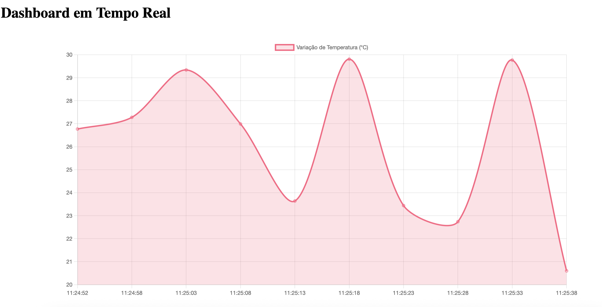
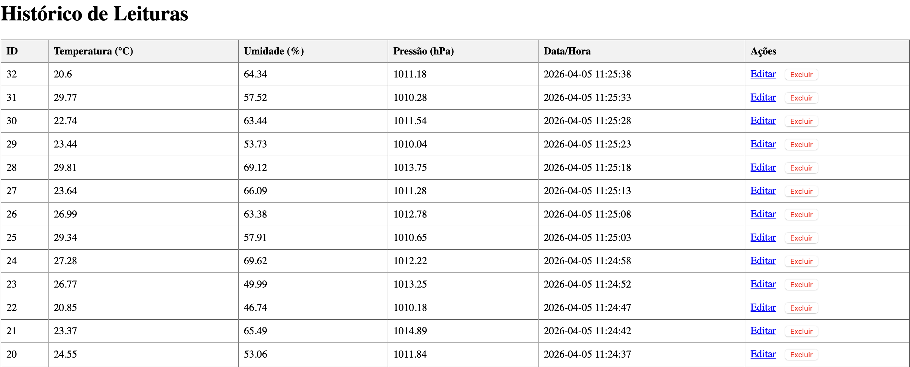
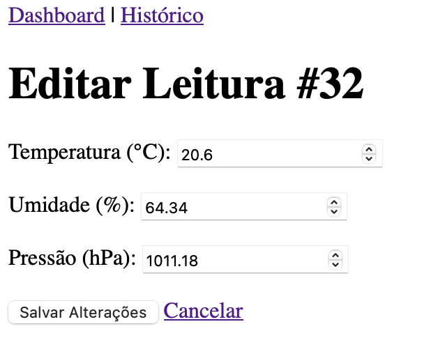
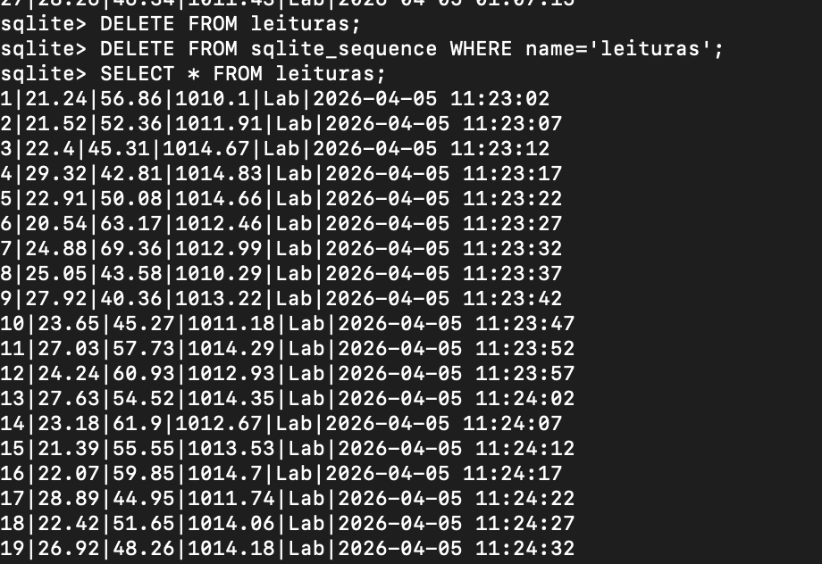
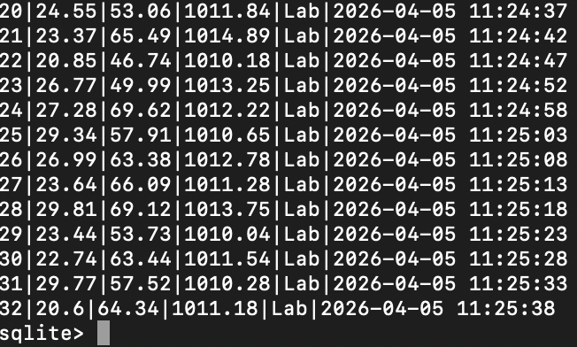
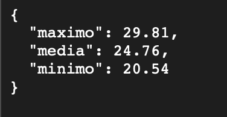

# Estação Meteorológica IoT — Projeto Flask

Este projeto é uma aplicação web para monitoramento de dados meteorológicos (temperatura, umidade, pressão) que utiliza Python, Flask e SQLite. Os dados são simulados e enviados automaticamente para a aplicação, permitindo visualização em tempo real, histórico, edição e exclusão.

---

## **Instruções de Instalação**

1. **Clone o repositório:**
   ```bash
   git clone https://github.com/josephmansur9/ponderada_murilo.git
   cd ponderada_murilo
   ```

2. **Instale as dependências:**
   ```bash
   pip install flask
   ```

3. **Inicialize o banco de dados:**
   O banco é criado automaticamente ao rodar o app pela primeira vez.

---

## **Como Executar**

1. **Inicie o servidor Flask:**
   ```bash
   python3 src/app.py
   ```
   O servidor fica disponível em [http://localhost:5001](http://localhost:5001).

2. **Inicie o simulador de dados:**
   Em outro terminal, execute:
   ```bash
   python3 src/serial_reader.py
   ```
   Esse arquivo manda leituras simuladas para a aplicação a cada 5 segundos.

---

## **Descrição das Rotas**

### **Rotas Web**
- **GET /**  
  Acesse [http://localhost:5001/](http://localhost:5001/) no navegador para ver o painel principal com as últimas 10 leituras.
  
  Para obter as últimas 10 leituras em JSON:
  [http://localhost:5001/?formato=json](http://localhost:5001/?formato=json)

- **GET /leituras**  
  Acesse [http://localhost:5001/leituras](http://localhost:5001/leituras) para ver o histórico completo em HTML.
  
  Para obter leituras paginadas em JSON:
  [http://localhost:5001/leituras?formato=json&limite=10&offset=0](http://localhost:5001/leituras?formato=json&limite=10&offset=0)

- **GET /leituras/<id>**  
  Acesse [http://localhost:5001/leituras/1](http://localhost:5001/leituras/1) para editar a leitura de ID 1.

---

### **Rotas de API**
- **GET /?formato=json**  
  Retorna as últimas leituras em formato JSON.

- **GET /leituras?formato=json&limite=10&offset=0**  
  Retorna leituras paginadas em JSON.

- **POST /leituras**  
  Adiciona uma nova leitura.

- **PUT /leituras/<id>**  
  Atualiza uma leitura existente.
- **DELETE /leituras/<id>**  
  Remove uma leitura.
- **GET /api/leituras?limite=20&offset=0**  
  Retorna 20 leituras a partir do 0, em JSON:
  http://localhost:5001/api/leituras?limite=20&offset=0

- **GET /api/estatisticas**  
  Retorna estatísticas (média, mínimo, máximo) das temperaturas:
  [http://localhost:5001/api/estatisticas](http://localhost:5001/api/estatisticas)

---

## **Sobre a Simulação de Dados**

Eu fiz a decisão de usar dados simulados porque acredito que isso torna o desenvolvimento mais ágil e a apresentação mais segura. No lugar de depender de sensores que podem sofrer com mau contato ou ruído elétrico durante a demonstração, a minha simulação garante que o foco esteja na funcionalidade do sistema, tornando o projeto mais replicável.

O arquivo `src/serial_reader.py` gera valores aleatórios de temperatura, umidade e pressão, enviando-os periodicamente para a API da aplicação, como se fossem leituras reais de uma estação meteorológica conectada via Arduino.

---

## Exemplos Visuais do Sistema

### Tela Principal
Exemplo da tela principal com gráfico:



### Histórico de Leituras
Histórico de leituras com várias linhas:



### Tela de Edição
Tela de edição de uma leitura:



### Exemplo do Dados no Banco
Exemplo de dados no banco de dados (SELECT * FROM leituras;) (não cabia as 30 linhas em uma imagem):



### Outro exemplo para mostrar mais linhas



### Exemplo de Resposta JSON
Exemplo de resposta do endpoint `/api/estatisticas`:



